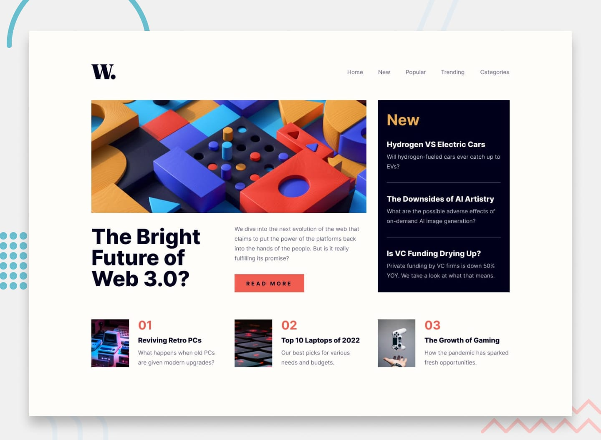

# Frontend Mentor - News homepage solution

This is a solution to the [News homepage challenge on Frontend Mentor](https://www.frontendmentor.io/challenges/news-homepage-i6qgnfNjhv). Frontend Mentor challenges help you improve your coding skills by building realistic projects.

## Table of contents

- [Overview](#overview)
  - [The challenge](#the-challenge)
  - [Screenshot](#screenshot)
  - [Links](#links)
- [My process](#my-process)
  - [Built with](#built-with)
  - [What I learned](#what-i-learned)
  - [Continued development](#continued-development)
- [Author](#author)

## Overview

### The challenge

Users should be able to:

- View the optimal layout for the interface depending on their device's screen size
- See hover and focus states for all interactive elements on the page

### Screenshot



### Links

- Solution URL: [Add your GitHub repo URL here](https://your-solution-url.com)
- Live Site URL: [Add your live site URL here](https://your-live-site-url.com)

## My process

### Built with

- Semantic HTML5 markup
- CSS custom properties
- CSS Grid
- Flexbox
- Mobile-first workflow
- Vanilla JavaScript for the mobile nav
- `<picture>` with a `media` source for the art-directed hero image (separate mobile/desktop crops)

### What I learned

The hero section's grid was the interesting part of this one: the "New" sidebar needs to visually span the full height of both the image *and* the title/description row beneath it, while the image and text below it stay in a single narrower column. CSS Grid's row-spanning made this straightforward without needing to fake it with absolute positioning:

```css
.hero {
  grid-template-columns: 2fr 1fr;
  grid-template-rows: auto auto;
}

.hero__image { grid-column: 1; grid-row: 1; }
.hero__intro { grid-column: 1; grid-row: 2; }
.new-panel   { grid-column: 2; grid-row: 1 / 3; }
```

### Continued development

- Revisit the mobile nav panel's close button hit area — it's small and could be more forgiving on touch.
- Look into whether the numbered "top picks" list should be a proper `<ol>` semantically instead of styled numbers in a `<p>`.

## Author

- GitHub - [@Chinomnso-Ugba](https://github.com/Chinomnso-Ugba)
- Frontend Mentor - [@1Chinomnso](https://www.frontendmentor.io/profile/1Chinomnso)
